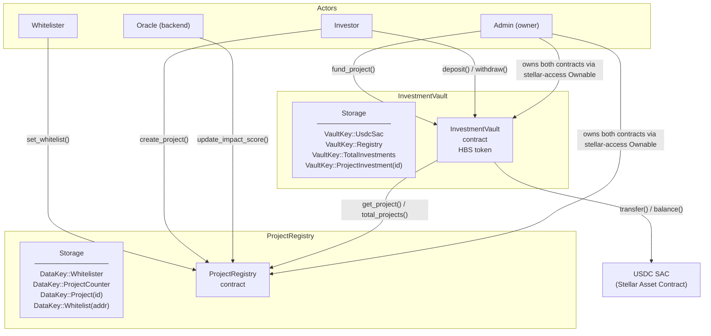

# Heliobond Contracts

On-chain core of [Heliobond](https://heliobond.io) — a green bond platform built on Stellar. Two [Soroban](https://stellar.org/soroban) smart contracts manage the full lifecycle from project registration through investor deposits and capital disbursement.

| Contract | Crate | Purpose |
|---|---|---|
| `ProjectRegistry` | `project_registry` | Stores project metadata and oracle-updated impact scores |
| `InvestmentVault` | `investment_vault` | SEP-41 token vault; accepts USDC and mints HBS shares |

---

## Architecture



**Data flow summary**

1. The Whitelister approves project creator addresses via `set_whitelist`.
2. A whitelisted creator calls `create_project`, which records metadata in `ProjectRegistry` and returns a sequential `project_id`.
3. The Oracle (off-chain backend) calls `update_impact_score` to set `credit_quality` and `green_impact` (both 0–100) for each project.
4. Investors call `deposit` on `InvestmentVault`, which pulls USDC and mints HBS shares proportional to vault NAV.
5. The Admin calls `fund_project`, which cross-calls `ProjectRegistry` to fetch the project owner address and then transfers USDC from the vault to that owner.
6. Investors call `withdraw` to burn HBS shares and redeem liquid USDC.

---

## Contract Reference

### Notification System

When impact scores change (via `update_impact_score` or `update_credit_quality_score`), the `ProjectRegistry` now emits a `ScoreChanged` event carrying both old and new score values. An off-chain notification service (`notification-service/`) monitors these events and dispatches email/webhook alerts to registered investors.

For details, see [`docs/NOTIFICATIONS.md`](./docs/NOTIFICATIONS.md).

### ProjectRegistry

**Constructor**

```
__constructor(admin: Address, whitelister: Address)
```

Sets the `Ownable` owner to `admin` and records the `whitelister` address.

**Public functions**

| Function | Auth required | Description |
|---|---|---|
| `set_whitelist(account, status)` | `Whitelister` | Grant or revoke whitelist status for a creator address |
| `create_project(creator, uri)` | `creator` | Register a new project; panics if caller not whitelisted; returns `project_id` (u32, auto-incremented) |
| `get_project(id)` | none | Return `ProjectData` for a given `project_id`; panics if not found |
| `total_projects()` | none | Return the current project counter |
| `update_impact_score(project_id, credit_quality, green_impact)` | `Admin` (`#[only_owner]`) | Set impact scores (0–100 each) for a project |
| `get_all_projects()` | none | Return `Vec<(u32, ProjectData)>` of all registered projects |
| `transfer_ownership(new_owner)` | `Admin` | Transfer contract ownership (via `stellar-access Ownable`) |

**ProjectData struct**

```rust
pub struct ProjectData {
    pub owner: Address,     // project creator
    pub uri: String,        // off-chain metadata URI
    pub credit_quality: u32, // 0–100 set by oracle
    pub green_impact: u32,   // 0–100 set by oracle
}
```

---

### InvestmentVault

**Constructor**

```
__constructor(admin: Address, usdc_sac: Address, registry: Address)
```

Sets the `Ownable` owner to `admin`, stores USDC SAC and Registry addresses, initialises `TotalInvestments` to 0, and sets the SEP-41 token metadata (symbol: `HBS`, name: `Heliobond Shares`, decimals: 7).

**Public functions**

| Function | Auth required | Description |
|---|---|---|
| `deposit(from, usdc_amount)` | `from` | Transfer USDC from investor into vault; mint HBS shares; return shares minted |
| `withdraw(from, shares_amount)` | `from` (via `Base::burn`) | Burn HBS shares; if liquid USDC covers the redemption transfer it immediately; otherwise enqueue a FIFO claim and return 0 |
| `claim()` | none | Settle queued redemptions in FIFO order using available liquid USDC; return total USDC paid out |
| `fund_project(project_id, amount)` | `Admin` (`#[only_owner]`) | Cross-call Registry to resolve project owner; transfer USDC from vault to owner; record investment |
| `total_assets()` | none | Return `liquid_USDC + total_investments + expected_returns` |
| `convert_to_shares(usdc_amount)` | none | Preview how many HBS a given USDC deposit would mint |
| `convert_to_assets(shares_amount)` | none | Preview how much USDC a given HBS redemption would return |
| `get_expected_returns()` | none | Iterate funded projects; sum `investment * (credit_quality + green_impact) / 200` |
| `transfer_ownership(new_owner)` | `Admin` | Transfer contract ownership |

The vault also exposes the full SEP-41 `FungibleToken` interface (`balance`, `transfer`, `allowance`, `approve`, etc.) and `FungibleBurnable` (`burn`, `burn_from`) from `stellar-tokens`.

---

## Share Pricing

The vault uses a proportional NAV model identical to ERC-4626.

**First deposit (no shares in existence)**

```
shares_minted = usdc_deposited        (1 : 1)
```

**Subsequent deposits**

```
shares_minted = usdc_deposited × total_supply / total_assets
```

**Redemption**

```
usdc_returned = shares_burned × total_assets / total_supply
```

`total_assets` = liquid USDC held by the vault + `TotalInvestments` + expected yield.  
Expected yield per project = `investment × (credit_quality + green_impact) / 200`, where both scores are in [0, 100].

Redemption is limited to the vault's liquid USDC balance; funds disbursed to project owners via `fund_project` are not available for immediate withdrawal.

---

## Build & Test

**Prerequisites:** [Stellar CLI](https://developers.stellar.org/docs/tools/stellar-cli) and a Rust toolchain with the `wasm32v1-none` target.

```bash
# Add the wasm target if not already present
rustup target add wasm32v1-none

# Build both contracts
make build
# Equivalent: stellar contract build
# Output: target/wasm32v1-none/release/project_registry.wasm
#         target/wasm32v1-none/release/investment_vault.wasm

# Run all 15 tests
make test
# Equivalent: cargo test
```

---

## Deploy to Testnet

Set the following environment variables then run `make deploy-testnet`:

```bash
export STELLAR_SECRET_KEY=S...       # deployer secret key
export ADMIN_ADDRESS=G...            # admin/owner address
export WHITELISTER_ADDRESS=G...      # whitelister address
export USDC_SAC_ADDRESS=G...         # USDC Stellar Asset Contract on testnet

make deploy-testnet
```

The command builds both contracts, deploys `ProjectRegistry` first, captures its contract ID, then deploys `InvestmentVault` wiring it to the registry. Both contract IDs are printed to the terminal and written to **`deploy/testnet.json`**:

```json
{
  "network": "testnet",
  "project_registry": "C...",
  "investment_vault": "C..."
}
```

`deploy/testnet.json` is checked into the repository as a placeholder; `make deploy-testnet` overwrites it with the real IDs after each deployment.

---

## Events Reference

Every state-changing function emits a structured event. Topics are indexed by the network and usable as Horizon event filters; data fields carry the full payload.

### InvestmentVault

| Event | Topics | Data | Emitted by |
|---|---|---|---|
| `Deposit` | `from` (Address) | `usdc_amount`, `shares_minted` (i128) | `deposit()` |
| `Withdraw` | `from` (Address) | `shares_burned`, `usdc_returned` (i128) | `withdraw()` — immediate path |
| `WithdrawQueued` | `from` (Address) | `shares_burned`, `usdc_owed` (i128) | `withdraw()` — queued path (insufficient liquidity) |
| `WithdrawClaimed` | `to` (Address) | `usdc_paid` (i128), `claim_index` (u64) | `claim()` |
| `ProjectFunded` | `project_id` (u32) | `amount` (i128), `recipient` (Address) | `fund_project()` |
| `YieldReceived` | `from` (Address) | `amount` (i128) | `receive_yield()` |
| `YieldClaimed` | `to` (Address) | `amount` (i128) | `claim_yield()` |
| `InsuranceClaimed` | `project_id` (u32) | `recipient` (Address), `amount` (i128) | `claim_insurance()` |
| `OwnershipTransfer` | (library) | `new_owner` (Address) | `transfer_ownership()` — emitted by `stellar-access` |
| `OwnershipTransferCompleted` | (library) | `new_owner` (Address) | `accept_ownership()` — emitted by `stellar-access` |
| `OwnershipRenounced` | (library) | — | `renounce_ownership()` — emitted by `stellar-access` |

### ProjectRegistry

| Event | Topics | Data | Emitted by |
|---|---|---|---|
| `ProjectCreated` | `project_id` (u32) | `owner` (Address), `uri` (String) | `create_project()` |
| `ProjectUpdated` | `project_id` (u32) | `credit_quality`, `green_impact` (u32) | `update_impact_score()` (only when values change) |
| `ScoreChanged` | `project_id` (u32) | `old_credit_quality`, `new_credit_quality`, `old_green_impact`, `new_green_impact`, `old_rate_bps`, `new_rate_bps` (u32) | `update_impact_score()`, `update_credit_quality_score()` (#131) |
| `CreditQualityUpdated` | `project_id` (u32) | `credit_quality` (u32) | `update_credit_quality_score()` (#6) |
| `WhitelistSet` | `account` (Address) | `status` (bool) | `set_whitelist()` |
| `ProjectCertified` | `project_id` (u32) | `status` (CertificationStatus) | `certify_project()` |
| `ProposalCreated` | `proposal_id` (u32) | `proposer` (Address), `voting_ends_at` (u64) | `create_proposal()` |
| `VoteCast` | `proposal_id` (u32) | `voter` (Address), `support` (bool), `weight` (i128) | `cast_vote()` |
| `ProposalExecuted` | `proposal_id` (u32) | `passed` (bool) | `execute_proposal()` |
| `OwnershipTransfer` | (library) | `new_owner` (Address) | `transfer_ownership()` — emitted by `stellar-access` |
| `OwnershipTransferCompleted` | (library) | `new_owner` (Address) | `accept_ownership()` — emitted by `stellar-access` |
| `OwnershipRenounced` | (library) | — | `renounce_ownership()` — emitted by `stellar-access` |

---

## Tech Stack

| Component | Version |
|---|---|
| Language | Rust (edition 2021, `#![no_std]`) |
| Soroban SDK | `soroban-sdk = 26.1.0` |
| OZ stellar-tokens | `stellar-tokens = 0.7.2` |
| OZ stellar-access | `stellar-access = 0.7.2` |
| OZ stellar-macros | `stellar-macros = 0.7.2` |
| Compile target | `wasm32v1-none` |
| Release profile | LTO, `opt-level = "z"`, `panic = "abort"` |
